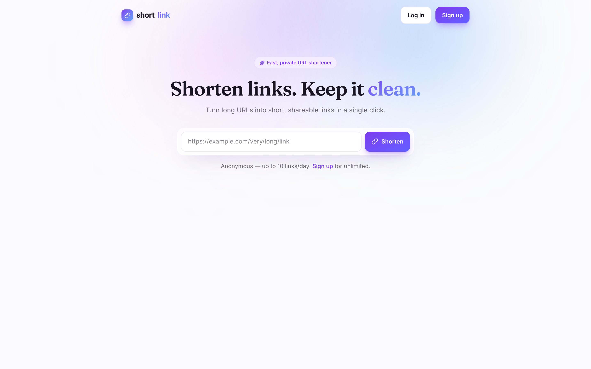
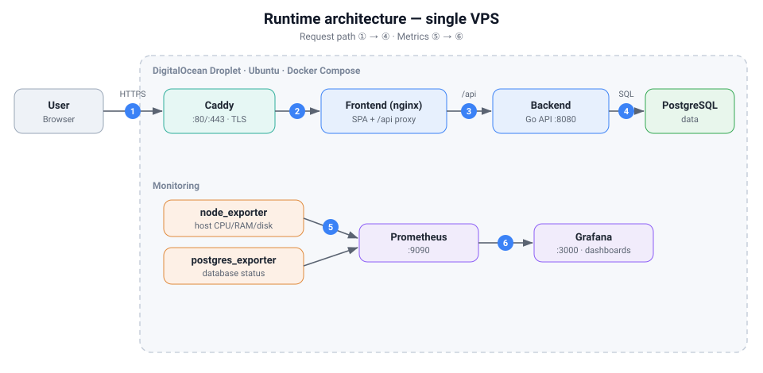

# ShortLink

A URL shortening service: shorten a long URL, share the short link, and get redirected to the
original. Registered users own and manage their links; anonymous users are rate-limited per IP.
It is a Go API + React frontend, deployed end-to-end with a full DevOps pipeline (Docker,
CI/CD, monitoring, and infrastructure-as-code).

- **Live demo:** https://shortlink.kyletruong.xyz
- **API docs (Swagger):** https://shortlink.kyletruong.xyz/swagger/index.html
- **Grafana** (monitoring, read-only): http://104.248.149.150:3000
- **Prometheus:** http://104.248.149.150:9090
- **Repository:** https://github.com/kytruongdev/shortlink



## Table of contents

1. [Features](#1-features)
2. [Architecture](#2-architecture)
3. [Project structure](#3-project-structure)
4. [Data model](#4-data-model)
5. [API](#5-api)
6. [Deployment & CI/CD](#6-deployment--cicd)
7. [Tech stack](#7-tech-stack)
8. [Run locally](#8-run-locally)

---

## 1. Features

- **Shorten & resolve** — turn a long URL into a short code; opening the short link shows a
  redirect page that sends the visitor to the original URL.
- **Accounts (JWT)** — register/login; logged-in users **own** their links and can **list,
  edit the destination, and delete** them, and see each link's **click count**.
- **Anonymous quota** — visitors without an account can create up to **10 links/day per IP**.
- **Deduplication** — the same URL returns the same short code.
- **Durable** — mappings live in PostgreSQL, so links keep resolving across restarts.

## 2. Architecture



The backend is a single Go service in three layers, with PostgreSQL behind the repository:

```
HTTP → handler → controller → repository → PostgreSQL
        (transport)  (business)   (storage)
```

- **handler** — routes (chi), JSON encode/decode, shape validation, auth middleware, maps
  domain errors to HTTP status. No business logic.
- **controller** — business logic: URL normalization/validation, dedup, code generation,
  quota, ownership, orchestration.
- **repository** — PostgreSQL access via `sqlc`-generated, type-safe code, behind an interface
  (so the controller is testable with a mock).

The **React SPA** (`web/`) is served together with the API behind one origin: nginx serves the
static app and reverse-proxies `/api` to the backend, so the browser talks to a single host
(no CORS or cross-site-cookie issues). Access tokens are short-lived JWTs kept in memory;
refresh tokens are httpOnly cookies.

**Correctness under concurrency.** Deduplication and code generation are check-then-act, so the
database — not the application — is the source of truth: `code` is a primary key and
`normalized_url` is `UNIQUE`, so a colliding `INSERT` fails (`23505`) and the controller
reconciles (re-fetch on a duplicate URL, regenerate on a code collision). This is safe even
under concurrent writes.

## 3. Project structure

```
shortlink/
├── api/                      # Go backend — module github.com/kytruongdev/shortlink
│   ├── cmd/server/           #   composition root (one binary)
│   ├── data/{migrations,queries}/   # golang-migrate + SQL source for sqlc
│   └── internal/
│       ├── config/  model/                     # env config; domain types + constants
│       ├── controller/{link,auth}/             # business logic
│       ├── repository/{sqlc,link,user,token}/  # sqlc + interfaces + mocks
│       ├── handler/{router.go,middleware.go,rest/}  # routes, auth middleware, handlers
│       ├── infra/{app,db/pg,httpserver}/       # runner, DB pool, HTTP plumbing
│       └── pkg/{urlshortener,auth,authctx,apperror,testutil}/
├── web/                      # React + Vite + TypeScript SPA
│   └── src/{api,auth,components,pages,lib}/
├── deploy/                   # deployment — see deploy/README.md
│   ├── compose/ caddy/ prometheus/ grafana/    # the production stack
│   ├── terraform/ ansible/ jenkins/            # IaC, config management, CD
│   └── diagrams/
└── .github/workflows/        # CI (tests) + build-push (images → GHCR)
```

## 4. Data model

Three tables (`links` is the core; `users` + `refresh_tokens` back authentication):

```sql
CREATE TABLE links (
    code           TEXT        PRIMARY KEY,            -- short code (base62, 7 chars)
    original_url   TEXT        NOT NULL,               -- the URL exactly as submitted
    normalized_url TEXT        NOT NULL UNIQUE,        -- canonical form, drives dedup
    created_at     TIMESTAMPTZ NOT NULL DEFAULT now(),
    user_id        UUID        REFERENCES users(id) ON DELETE SET NULL,  -- NULL = anonymous
    creator_ip     TEXT,                               -- for the per-IP anonymous quota
    click_count    INT         NOT NULL DEFAULT 0      -- incremented on resolve
);

CREATE TABLE users (
    id            UUID        PRIMARY KEY DEFAULT gen_random_uuid(),
    email         TEXT        NOT NULL UNIQUE,
    password_hash TEXT        NOT NULL,                -- bcrypt
    created_at    TIMESTAMPTZ NOT NULL DEFAULT now()
);

CREATE TABLE refresh_tokens (
    id         UUID        PRIMARY KEY DEFAULT gen_random_uuid(),
    user_id    UUID        NOT NULL REFERENCES users(id) ON DELETE CASCADE,
    token_hash TEXT        NOT NULL UNIQUE,            -- SHA-256 of the token
    expires_at TIMESTAMPTZ NOT NULL,
    revoked_at TIMESTAMPTZ,
    created_at TIMESTAMPTZ NOT NULL DEFAULT now()
);
```

## 5. API

Business endpoints live under `/api/v1`; every response is JSON. Full, interactive contract:
the **Swagger UI** linked above.

| Method | Path | Purpose |
|---|---|---|
| `POST` | `/api/v1/encode` | Shorten a URL (owned when authenticated, else per-IP quota) |
| `POST` | `/api/v1/decode` | Resolve a short URL/code to the original |
| `GET`  | `/api/v1/{code}` | Resolve for the frontend redirect; counts the click |
| `POST` | `/api/v1/auth/{register,login,refresh,logout}` | Authentication |
| `GET`  | `/api/v1/links` | List the current user's links |
| `PATCH`/`DELETE` | `/api/v1/links/{code}` | Edit destination / delete (owner only) |
| `GET`  | `/healthz`, `/readyz` | Liveness / readiness probes |

Errors are JSON with a stable `code` and a `message`, e.g. `{"code":"NOT_FOUND","message":"short url not found"}`.

## 6. Deployment & CI/CD

The app is containerized and shipped to a VPS through two flows:

- **Continuous CI/CD** — a push to `master` triggers **GitHub Actions** (test, build the
  backend/frontend images, push to **GHCR**); **Jenkins** on the VPS pulls the new images and
  redeploys.
- **One-time provisioning** — **Terraform** creates the VPS and **Ansible** installs Docker and
  deploys the stack; **Caddy** serves it over HTTPS. **Prometheus + Grafana** monitor host and
  database.

**Infrastructure & security.** One DigitalOcean droplet (2 vCPU / 4 GB, Ubuntu 24.04),
provisioned and firewalled by Terraform. HTTPS via Caddy + Let's Encrypt (auto-renewed, HTTP
redirected); PostgreSQL is never exposed publicly; all secrets stay out of the repo. See
[deploy/README.md](deploy/README.md#security) for details.

**The complete step-by-step guide** — environment prep, the `Localhost → Docker Desktop → VPS`
flow, configuration, the pipeline diagram, and operations — is in
**[deploy/README.md](deploy/README.md)**.

## 7. Tech stack

| Area | Tools |
|---|---|
| Backend | Go · chi · PostgreSQL · sqlc · pgx |
| Frontend | React · Vite · TypeScript · Tailwind |
| Containers | Docker · Docker Compose |
| CI | GitHub Actions → GHCR |
| CD | Jenkins |
| Monitoring | Prometheus · Grafana · node_exporter · postgres_exporter |
| Infrastructure | Terraform (DigitalOcean) |
| Configuration management | Ansible |
| Edge / TLS | Caddy (Let's Encrypt) |

## 8. Run locally

The whole stack runs on Docker Desktop as a single origin:

```bash
cp deploy/.env.prod.example deploy/.env.prod        # BASE_URL/ALLOWED_ORIGINS = http://localhost
docker compose -p shortlink-prod --env-file deploy/.env.prod \
    -f deploy/compose/docker-compose.prod.yml up -d --build
open http://localhost                                # app · /swagger/index.html
```

For local development (running the API and frontend directly) and for production deployment,
see **[deploy/README.md](deploy/README.md)**.
