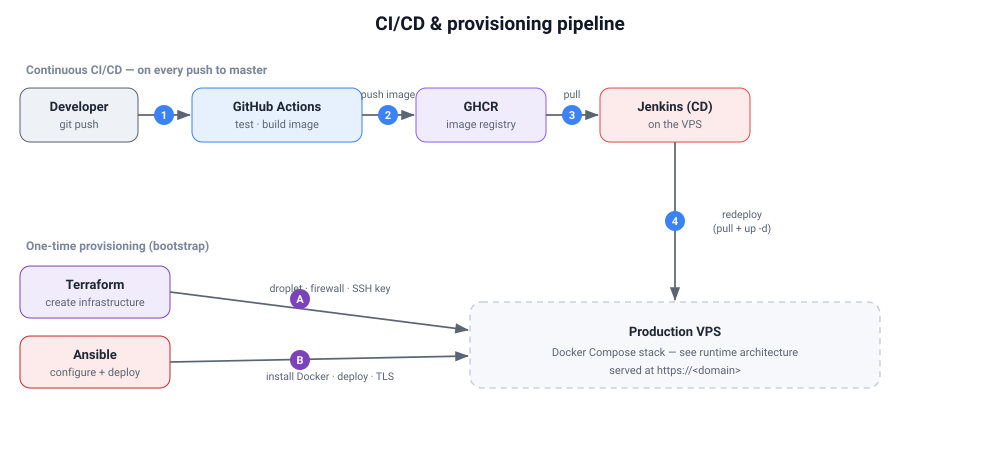
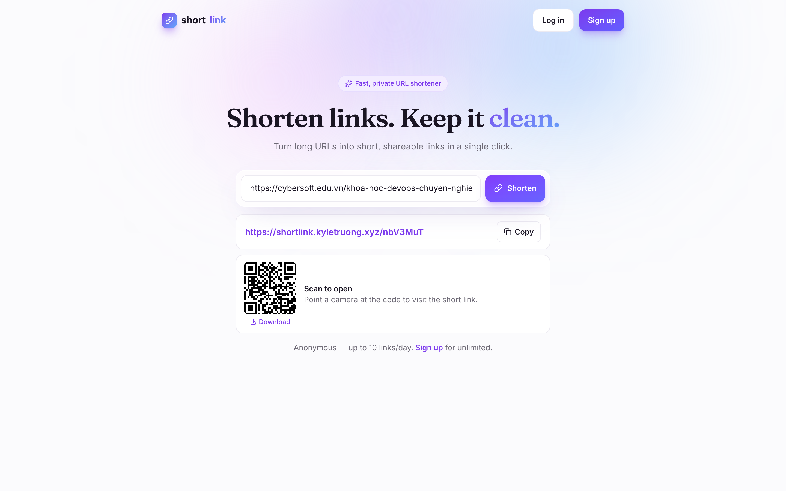
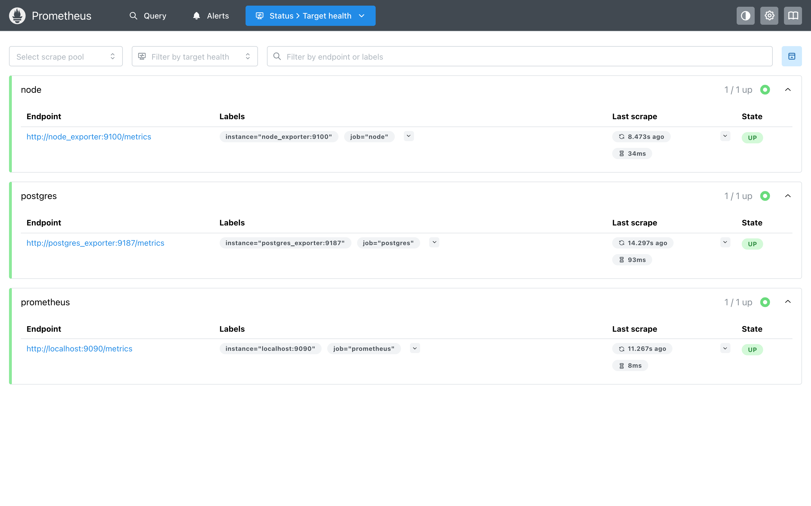
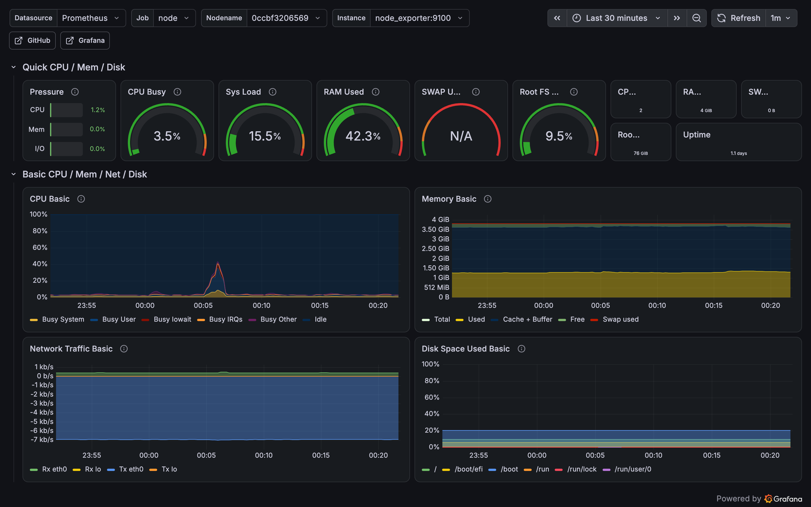

# ShortLink — Deployment

The deployment guide for ShortLink: how the app is configured and connected, the **deployment
process** across three environments (**Localhost → Docker Desktop → VPS**), how to **redeploy** a
new version, and how to **operate** it.

## Overview



The delivery process has two flows:

- **Continuous CI/CD** — a push to `master` triggers **GitHub Actions** (test + build the
  backend/frontend images → **GHCR**); **Jenkins** on the VPS pulls the new images and redeploys.
- **One-time provisioning** — **Terraform** creates the VPS, **Ansible** installs Docker and
  deploys the stack, and **Caddy** issues the TLS certificate.

**Live services**

| Service | URL | Access |
|---|---|---|
| App | https://shortlink.kyletruong.xyz | public |
| Swagger UI | https://shortlink.kyletruong.xyz/swagger/index.html | public |
| Grafana | http://104.248.149.150:3000 | read-only (anonymous viewer) |
| Prometheus | http://104.248.149.150:9090 | public |
| Jenkins | http://104.248.149.150:8080 | login required (CD) |



## Infrastructure & security

**Infrastructure**

- **Provider:** DigitalOcean — one droplet `s-2vcpu-4gb` (2 vCPU / 4 GB), **Ubuntu 24.04**,
  region `sgp1`. The whole stack runs on this single VPS via Docker Compose.
- **Provisioned by Terraform**, including the firewall — inbound `22` (SSH), `80`/`443`
  (web + TLS), `3000` (Grafana), `9090` (Prometheus), `8080` (Jenkins).

**Security**

- **HTTPS everywhere** — Caddy obtains and auto-renews a Let's Encrypt certificate; HTTP is
  redirected to HTTPS. Single origin, so there is no cross-site surface.
- **Secrets stay out of the repo** — the DigitalOcean token is passed via `DIGITALOCEAN_TOKEN`;
  Terraform state, `*.tfvars`, `ansible/vars.yml`, and `.env.prod` are gitignored.
- **Network** — the firewall limits inbound ports, and **PostgreSQL is not published** (internal
  Docker network only).
- **Auth** — short-lived JWT access tokens + refresh tokens in `HttpOnly; Secure; SameSite=Strict`
  cookies; bcrypt passwords; refresh tokens stored hashed.
- **Images** — built in CI and pulled on the server (no building in production); tagged by commit
  `sha`.

## Configuration & service connections

Everything is environment-driven. Two connections matter:

**Backend → Database** — the backend reads `DATABASE_URL`:

| Environment | Host |
|---|---|
| Localhost | `localhost:5432` |
| Docker Desktop / VPS | `postgres:5432` (Compose service) |

**Frontend → Backend** — the axios client (`web/src/lib/apiClient.ts`) uses `baseURL =
import.meta.env.VITE_API_BASE_URL`, a build-time value:

| Environment | `VITE_API_BASE_URL` | How it reaches the backend |
|---|---|---|
| Localhost | `http://localhost:8080/api/v1` | direct, cross-origin (CORS) |
| Docker Desktop / VPS | `/api/v1` (relative) | same origin — nginx proxies `/api` |

**Environment variables** (`deploy/.env.prod`, rendered by Ansible from `ansible/vars.yml`):

| Variable | Notes |
|---|---|
| `POSTGRES_USER` / `POSTGRES_PASSWORD` / `POSTGRES_DB` | Database credentials |
| `DATABASE_URL` | Backend + migrate DSN |
| `BASE_URL` / `ALLOWED_ORIGINS` | Public origin (`public_url`) |
| `JWT_SECRET` | ≥ 32 bytes |
| `ACCESS_TOKEN_TTL` / `REFRESH_TOKEN_TTL` | e.g. `5m` / `168h` |
| `COOKIE_SECURE` | `true` under HTTPS |
| `GRAFANA_ADMIN_USER` / `GRAFANA_ADMIN_PASSWORD` | Grafana login |

`ansible/inventory.ini`, `ansible/vars.yml`, the Terraform state, and `.env.prod` are
gitignored — only the `.example` files are committed.

---

## Deployment process

Work through the environments in order — each builds confidence for the next.

### Environment 1 — Localhost (development)

**Purpose:** fast edit loop while developing.

```bash
cd api && make up          # Postgres + migrations + API on :8080 (env baked into the local compose)
cd web && cp .env.example .env && npm install && npm run dev   # Vite on :5173, hot reload
```

**Result:** open http://localhost:5173 — the frontend (`:5173`) calls the backend (`:8080`)
cross-origin. Tests: `cd api && make test`.
**Stop:** `cd api && make down` (use `make reset` to also wipe the database volume).

### Environment 2 — Docker Desktop (full stack, single origin)

**Purpose:** run the exact production stack in containers before touching a server.

```bash
cp deploy/.env.prod.example deploy/.env.prod       # BASE_URL/ALLOWED_ORIGINS = http://localhost
docker compose -p shortlink-prod --env-file deploy/.env.prod \
    -f deploy/compose/docker-compose.prod.yml up -d --build
```

**Result:** open http://localhost — one origin, the frontend built with `VITE_API_BASE_URL=/api/v1`
talking to the backend through nginx, exactly as in production.
**Stop:** `docker compose -p shortlink-prod -f deploy/compose/docker-compose.prod.yml down`.

### Environment 3 — VPS (production)

**Prerequisites (once):** `terraform`, `ansible`, `docker`, `ssh`; a DigitalOcean **API token**;
the GHCR images **public**; a **domain**; a deploy key (`ssh-keygen -t ed25519 -f
~/.ssh/shortlink_deploy -N ""`); and `cp deploy/ansible/vars.yml.example deploy/ansible/vars.yml`
filled in.

**Step 1 — Provision the server (Terraform).**
Creates the droplet, firewall, and SSH key.
```bash
export DIGITALOCEAN_TOKEN=dop_v1_xxxxx
cd deploy/terraform && terraform init && terraform apply
terraform output -raw droplet_ip
```
*Verify:* `ssh -i ~/.ssh/shortlink_deploy root@<DROPLET_IP>` connects.

**Step 2 — Configure & deploy (Ansible).**
Installs Docker, clones the repo to `/opt/shortlink`, renders `.env.prod`, pulls the images, and
starts the stack.
```bash
cd deploy/ansible
printf '[shortlink]\n<DROPLET_IP>\n' > inventory.ini
ansible-playbook playbook.yml
```
*Verify:* http://`<DROPLET_IP>` serves the app.

**Step 3 — Domain & HTTPS (Caddy).**
Fronts the app on 80/443 and issues the Let's Encrypt certificate.
1. DNS **A record**: `shortlink.<your-domain>` → `<DROPLET_IP>`.
2. Set the domain in `deploy/caddy/Caddyfile`; in `ansible/vars.yml` set `public_url:
   https://shortlink.<your-domain>` and `cookie_secure: "true"`.
3. `ansible-playbook playbook.yml -e health_url=https://shortlink.<your-domain>/`

*Verify:* https://`shortlink.<your-domain>` loads with a valid certificate.

**Step 4 — Continuous deployment (Jenkins).**
Brings up Jenkins with the CD pipeline preconfigured.
```bash
cd deploy/ansible && ansible-playbook jenkins.yml
```
*Verify:* http://`<DROPLET_IP>`:8080 (log in with `jenkins_admin_*`) shows the **shortlink-deploy**
job; running it pulls the latest images and redeploys.

**Step 5 — Monitoring.**
Prometheus scrapes host + database; Grafana renders the dashboards.





**Step 6 — Teardown (when the environment is no longer needed).**
Removes the droplet, firewall, and SSH key created in Step 1.
```bash
cd deploy/terraform && terraform destroy
```

---

## Redeploying a new version

- **Through the pipeline (normal path):** push to `master` → GitHub Actions builds and pushes new
  images → run the **shortlink-deploy** job in Jenkins (pulls the images and recreates the stack).
- **Manually on the server** (from `/opt/shortlink/deploy`):
  ```bash
  C="docker compose -p shortlink-prod --env-file .env.prod -f compose/docker-compose.prod.yml"
  $C pull && $C up -d          # zero data-layer downtime; the pgdata volume is untouched
  ```
- **Infra or config change:** re-run `terraform apply` (infrastructure) or `ansible-playbook
  playbook.yml` (config/deploy).

## Operations & troubleshooting

On the droplet (`ssh -i ~/.ssh/shortlink_deploy root@<DROPLET_IP>`), from `/opt/shortlink/deploy`
with `C` as above:

```bash
$C ps                  # service status
$C logs -f backend     # follow a service's logs
$C restart backend     # restart one service
```

| Symptom | Check |
|---|---|
| App unreachable | `$C ps`; `$C logs frontend backend` |
| No TLS certificate | DNS resolves to the droplet? ports 80/443 open? `$C logs caddy` |
| DB errors | `$C logs postgres`; Grafana → PostgreSQL dashboard |
| Anonymous quota looks global | expected — behind the proxy the backend sees the proxy IP, not the visitor's; logged-in users are unaffected |
